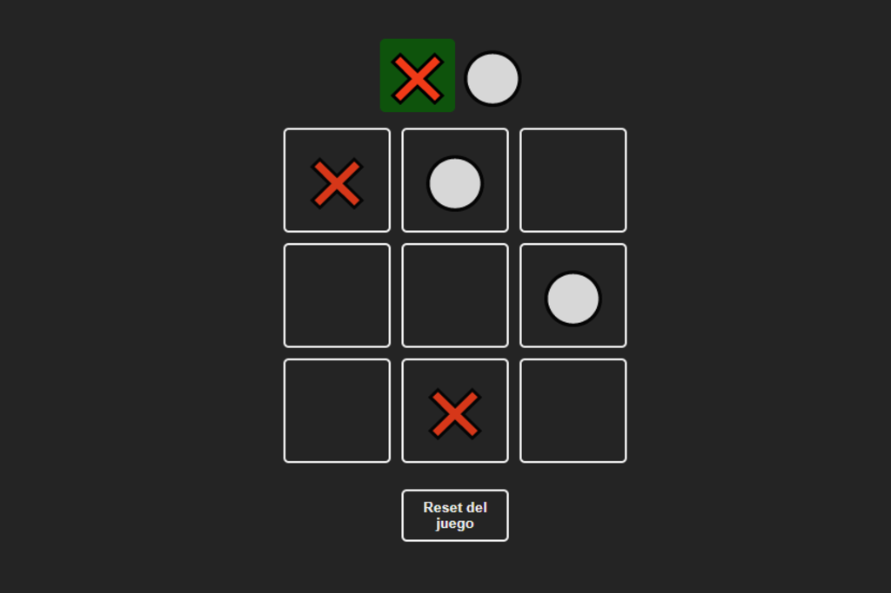

# React Tic Tac Toe

This is a project of a Tic Tac Toe game made in React. This game allows players to play against the opponent and save the game state in local storage.

## Getting Started

To get a copy of this project and run it locally on your machine, follow these simple steps:

1. Clone the repository:
   > git clone https://github.com/[username]/tic-tac-toe-react.git
2. Enter the project folder:
   > cd tic-tac-toe-react
3. Install the necessary dependencies:
   > npm install
4. Start the application:
   > npm start

After these steps, the application should start in your browser at `http://localhost:3000/`.

## Playing

The game is simple. Each player takes turns to place their piece (X or O) in an empty square on the board. The first player to have a complete line (horizontal, vertical, or diagonal) with their pieces wins the game. If all squares are filled and no player has won, the game is declared a draw.

## Local storage storage

The current state of the game is saved in the local storage of your browser each time a move is made. This way, if you close the tab or reload the page, the game can continue from where it was left.

## Contribution

This project is open-source and any contribution is welcome. To contribute, simply open a pull request with a clear description of your changes.

## Screenshot

  

## Test Project

> https://lucasbutto.github.io/tic-tac-toe/
